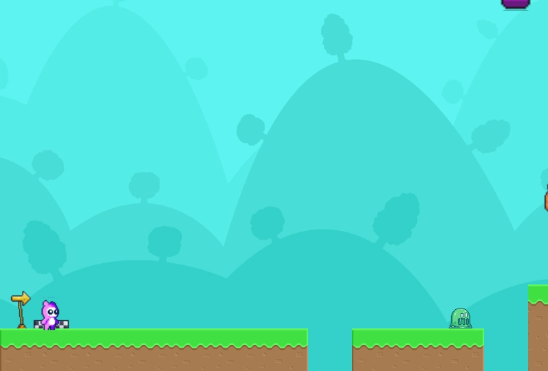
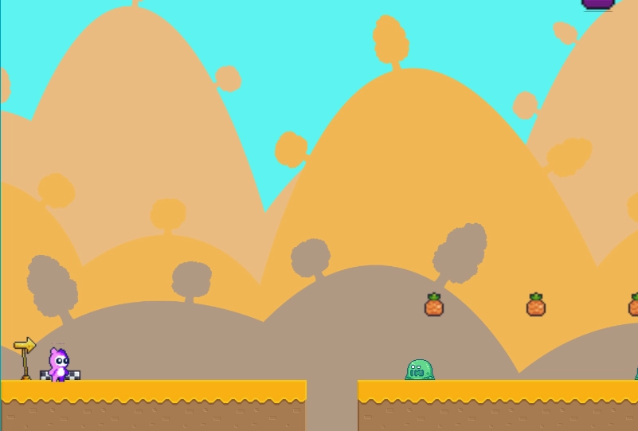

# PineHopper


## 📖 Descripción

**PineHopper** es una página web interactiva que aloja un juego 2D de plataformas desarrollado completamente desde cero. Combina una experiencia web moderna con un juego arcade clásico, ofreciendo tanto contenido promocional como la posibilidad de jugar directamente en el navegador con tecnología HTML5 Canvas.

## ✨ Características

- **Página principal** con presentación y promoción del juego
- **Sección de personajes** con tarjetas interactivas y detalles
- **Exploración de mundos** con información detallada de cada nivel
- **Trailer integrado** con reproductor optimizado
- **Juego jugable** directamente en el navegador con canvas HTML5
- **Sistema de niveles** con dificultad progresiva y boss final
- **Animaciones fluidas** y efectos visuales avanzados
- **Diseño responsive** optimizado para todos los dispositivos

## 🚀 Demo

**🔗 Demo en vivo:** [https://pinehopper.adriancc.com/](https://pinehopper.adriancc.com/)

## 📸 Capturas de pantalla

### Página Principal


### Tutorial del Juego


### Gameplay - Stage 1


### Boss Final


## 🛠️ Tecnologías utilizadas

### Frontend
- **Angular:** 18.2.0
- **TypeScript:** 5.5.2
- **HTML5 Canvas**

### UI & Componentes
- **Bootstrap:** 5.3.5
- **Swiper:** 11.2.6

### Game Engine
- **Phaser:** 3.88.2

### Multimedia
- **Lite YouTube:** 1.8.0

### Desarrollo & Build
- **Angular CLI:** 18.2.11
- **Node.js**

### Animaciones
- **Angular Animations:** 18.2.0

### Deploy & Infrastructure
- **Servidor VPS privado con dominio personalizado**

## 📋 Prerrequisitos

Antes de comenzar, asegúrate de tener instalado:

- [Node.js](https://nodejs.org/) (versión 16.0.0 o superior)
- [npm](https://www.npmjs.com/) 
- [Angular CLI](https://angular.io/cli) (recomendado globalmente)
- [Git](https://git-scm.com/)

## ⚙️ Instalación

1. **Clona el repositorio**
   ```bash
   git clone https://github.com/tuusuario/PineHopper.git
   ```

2. **Navega al directorio del proyecto**
   ```bash
   cd PineHopper
   ```

3. **Instala las dependencias**
   ```bash
   npm install
   ```

4. **Ejecuta la aplicación**
   ```bash
   ng serve
   # o
   npm start
   ```

5. **Abre tu navegador** y visita `http://localhost:4200`

## 🏗️ Estructura del proyecto

```
PineHopper/
├── .vscode/
├── public/
│   ├── assets/
│   │   ├── Backgrounds/
│   │   ├── CharacterAnimation/
│   │   ├── Clouds/
│   │   ├── enemies/
│   │   ├── font/
│   │   ├── GUI/
│   │   ├── Items/
│   │   ├── Platforms/
│   │   ├── Sounds/
│   │   ├── Tiles/
│   │   ├── webIcons/
│   │   ├── webImages/
│   │   └── webVideos/
│   └── logo.png
├── src/
│   ├── app/
│   │   ├── components/
│   │   │   ├── feature-card/
│   │   │   ├── footer/
│   │   │   ├── game/
│   │   │   ├── navbar/
│   │   │   └── swipper-card/
│   │   ├── interfaces/
│   │   ├── pages/
│   │   │   ├── characters/
│   │   │   ├── game-window/
│   │   │   ├── home/
│   │   │   ├── trailer/
│   │   │   └── worlds/
│   │   └── services/
│   ├── gameAssets/
│   │   └── game/
│   │       ├── entities/
│   │       ├── scenes/
│   │       ├── utils/
│   │       └── config.js
│   ├── index.html
│   ├── main.ts
│   └── styles.css
├── angular.json
├── package.json
├── tsconfig.json
└── README.md
```

## 🔧 Scripts disponibles

```bash
ng serve          # Ejecuta la app en modo desarrollo
ng build          # Construye la app para producción
ng build --watch  # Construye con watch mode
ng test           # Ejecuta las pruebas unitarias
```

## 🎮 Características del Juego

El juego incluye múltiples elementos desarrollados desde cero:
- **Motor de física** personalizado con Phaser
- **Sistema de animaciones** fluidas del personaje
- **IA de enemigos** con comportamientos únicos
- **Boss final** con mecánicas especiales
- **Mundos temáticos:** vanilla, otoño, invierno, infierno
- **Sistema de coleccionables** (piñas como elemento principal)
- **Checkpoints** para guardar progreso
- **Audio dinámico** con música y efectos de sonido

## 📱 Responsive Design

La aplicación está optimizada para:
- 📱 **Mobile** (320px+)
- 📟 **Tablet** (768px+)  
- 💻 **Desktop** (1024px+)
- 🖥️ **Large Desktop** (1440px+)

## 🎨 Diseño

### Paleta de colores
- **Base:** Colores vibrantes inspirados en juegos arcade
- **Estilo:** Retro-moderno con elementos pixelart

### Tipografía
- **Monogram**: Fuente principal para textos del juego
- **Audiowide**: Títulos y elementos destacados

## 📂 Funcionalidades

### Implementadas ✅
- [x] Página de inicio con información general del juego
- [x] Sección de personajes con tarjetas interactivas
- [x] Exploración de mundos con detalles de cada nivel
- [x] Trailer integrado con reproductor optimizado
- [x] Juego completo jugable en navegador
- [x] Tutorial interactivo con controles explicados
- [x] Sistema de múltiples niveles con dificultad progresiva
- [x] Boss final con mecánicas especiales
- [x] Sistema de checkpoints y guardado de progreso
- [x] Efectos de sonido y música de fondo
- [x] Animaciones fluidas del personaje
- [x] Múltiples mundos temáticos
- [x] Diseño responsive completo

## 🚀 Deployment

La aplicación está desplegada en un servidor VPS privado:

### Configuración del servidor
- **OS:** Linux/Ubuntu Server
- **Web Server:** Configuración personalizada
- **SSL:** Certificado configurado
- **Dominio:** pinehopper.adriancc.com

### Para deploy local
1. Ejecuta `ng build --prod`
2. Los archivos se generan en la carpeta `dist/`
3. Sube el contenido a tu servidor web

## 🐛 Reportar problemas

Si encuentras algún bug o tienes sugerencias:

1. Verifica que no exista un issue similar
2. Crea un [nuevo issue](https://github.com/Kvr0th3c4t/PineHopper/issues)
3. Proporciona toda la información relevante

## 📝 Licencia

Este proyecto está bajo la Licencia MIT - mira el archivo [LICENSE](LICENSE) para más detalles.

## 👨‍💻 Autor

**Adrián Carmona**
- Email: adrianc.crim@hotmail.com
- Website: [pinehopper.adriancc.com](https://pinehopper.adriancc.com/)

## 🙏 Agradecimientos

- [Phaser Community](https://phaser.io/) por el excelente motor de juegos 2D
- [Angular Team](https://angular.io/) por el framework robusto
- [Bootstrap](https://getbootstrap.com/) por los componentes UI responsivos
- [https://itch.io/] y a sus artistas por los diseños 
- Comunidad de desarrollo indie por la inspiración

## 📊 Estado del proyecto


---

⭐️ **¡No olvides darle una estrella al proyecto si te gustó!** ⭐️

> **Nota:** Este es un proyecto personal desarrollado con fines educativos y de entretenimiento. Toda la música y assets visuales son de uso libre o creación propia.
